# Honesty Bakery

The Honesty Bakehouse is a local cake and sweet store which I have built this full-stack website for. Built with React, it caters to all audiences who pass the physical shop. There are limitedf pages, but it is consistent in design and offers an intuitive layout. 

--- 

## Testing 

This section documents full-scope testing, from beginning to end of production, using manual and automated tests. 

### Manual Testing

1. One of the first manual tests carried out was to click on one of the products displayed on the homescreen to see if the productScreen.js renders properly. For this to be successful, it needs to take you to a new page (not open a new one), show the 3 collumns (image, price, and details). 

I first Clicked on the 'Birthday Cake':

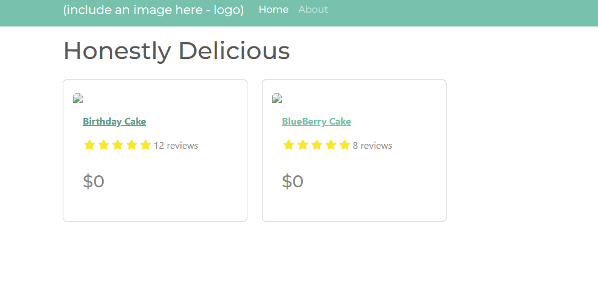

As you can see, it rendered successfully (excluding image fail).

2. The second manual test was to see if the if-statement properly checked if the product items are in stock. You can see the code below:

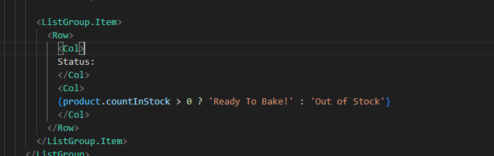

After saving and refreshing the live server (npm start - since it's react), the product screen showed 'Ready to Bake!' since I had set the stock to be greater than zero. 

Status:
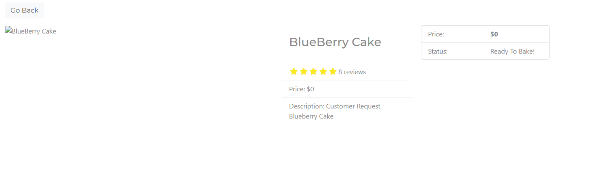

Product.js showing stock as 1:
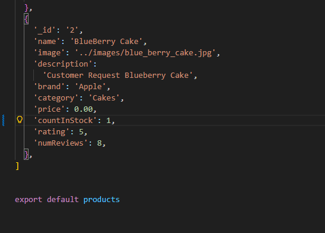

### Automated Testing

#### Jest

#### Python Tests

### Bugs

#### Frontend Bugs

1. Product Display Bug

The above image shows a classic bug caused by using Javascript Style comments within a JSX sextion. To remove this problem, I simply put curly braces around the Javascript style comments within thye JSX section, and it was resolved. 

Here it is fixed:

2. Product Screen (First bug)

The error is clear - 'Product' is not recognised. So, to solve this, I did some searching and found that the error was simple: misspelled 'product' as 'Product'. 

So I changed it to as lower-case p, and it worked:

3. Go Back Button

This above image shows a blank screen, but there should be a 'Go Back' button listed, as that is what I had coded to be returned on this page. I learned that this was due to the spelling of a className used in the link: 'btn-Light' should be 'btn-light'. 

Solved:

#### Backend Bugs

--- 

### Setting Up Virtual Environment

Before you begin any work on the backend, it's best to set up your virutal environment. To do this, type the command "pip install virtualenv" into your terminal. Once installed, you are ready to activate the virtual environment. 

The screenshot below shows how this is done in the terminal:

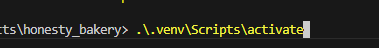

Then, once activated, you will see ".venv" at the far left of your terminal:

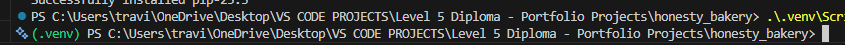

Following that, you'll want to install django with "pip install django", and this will install the latest version:

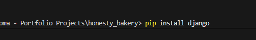

### Creating Django Project

Once installed, you will then want to create the backend project using "django-admin startproject (projectname)"

I called mine 'Backend', so you can see it successfuly created below ".venv" in this screenshot:

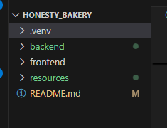

### Creating Individual Apps

Once Django is ready, it's time to start creating backend apps. Before you do this, you will need to change into the project directory. For me, this command is "cd backend" from the root directory. 

Then, you will need to type the command "python manage.py startapp (appname)":

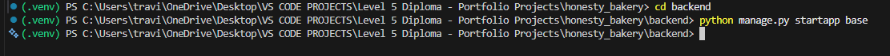

### Writing Your First View

When it comes to ensuring the backend project is connected to your backend app, you need to test that using a basic view and url pattern. I did this by first writing a view called getRoutes and returning 'Hello World.' 

Once that view is written, I then created a urls.py folder in the only app I have ('base'), and then importing that view I just created. 

I created the url pattern which states that when hitting the homescreen (''), I render the view getRoutes, and I gave it the name "get-routes". 

However, this wouldn't work just yet; I needed to connect the urls I created in the app to the main urls.py file in the backend project (called 'backend').

To do this, first add 'include' to the list of imports from django.urls. 

Then, add a new path to the urlpatterns. This will be as shown in the below screenshot:

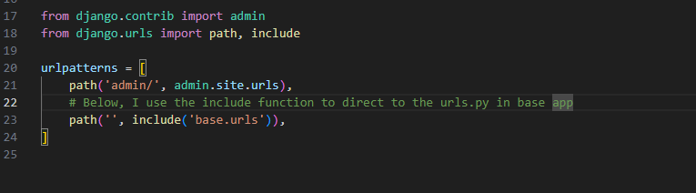

### Using Django Rest Framework

The reason I decided to do this was because the Django Rest Framework will make my api's more powerfull. 

To install it, type this into your terminal: "pip install djangorestframework".

Once that is successfull, add 'rest_framework' to your installed apps section in settings.py. 

From there, you will need to head over to https://www.django-rest-framework.org/, and click on views, under the 'api' section:

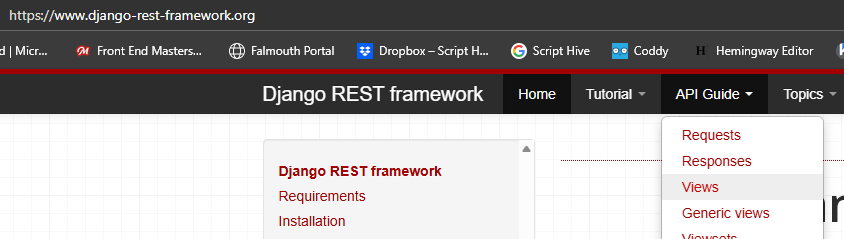

Then, on the right hand side of the screen, click on 'api_view' and copy the highlighted text below to then paste into the views.py in your app:

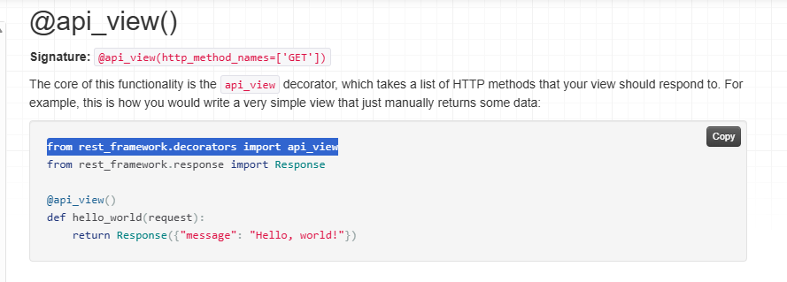

## Tech. Used

1. HTML5
2. CSS3
3. ReactBoostrap, found (https://react-bootstrap.netlify.app/)[here].
4. Bootswatch.
5. React.js
6. JavaScript
7. Django
8. Django Rest Framework