# Honesty Bakery

The Honesty Bakehouse is a local cake store which I have built this full-stack website for. Created with React, it caters to all audiences who pass the physical shop. There are limited pages, but it is consistent in design and offers an intuitive layout. 

--- 

## Testing 

This section documents full-scope testing, from beginning to end of production, using manual and automated tests. 

### Manual Testing

1. One of the first manual tests carried out was to click on one of the products displayed on the homescreen to see if the productScreen.js renders properly. For this to be successful, it needs to take you to a new page (not open a new one), show the 3 collumns (image, price, and details). 

I first Clicked on the 'Birthday Cake':

As you can see, it rendered successfully (excluding image fail).

2. The second manual test was to see if the if-statement properly checked if the product items are in stock. You can see the code below:

After saving and refreshing the live server (npm start - since it's react), the product screen showed 'Ready to Bake!' since I had set the stock to be greater than zero. 

Status:

Product.js showing stock as 1:

#### Checkout Testing

1. 'Add to Cart' button:

Clicking the 'Add to Cart' button took me straight to the cart page, displaying the total in the basket and total amount.

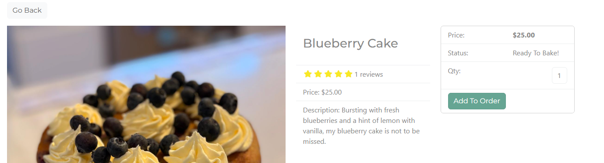

Cart page:

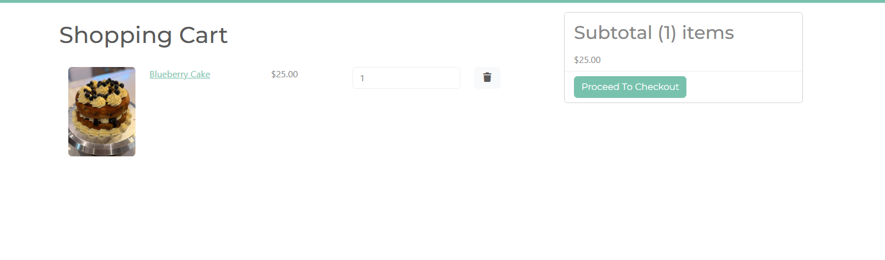

This all worked fine, however, I decided this wasn't best for the user experience. My plans moving forward were to create a notification that pops up for 5 seconds, showing that the item is added to the cart, but they stay on the same screen (unless the user clicks on the cart icon to go to the cart screen). 

This would make for a better experience, because the user wouldn't then have to keep clicking out of the cart screen if they wish to purcahse more products.

#### Login Testing

I attempted to log in after successfully registering a user (**include this above**), and I was met with an error 400 response. 

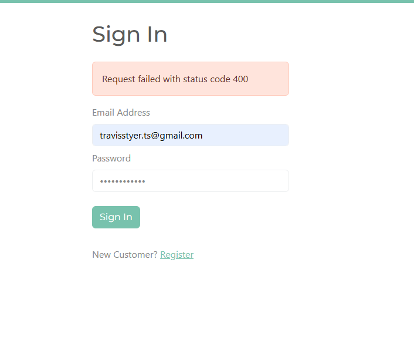

I checked the 'Network' tab in dev tools and tried to log in again, and found the error 400 in userActions:

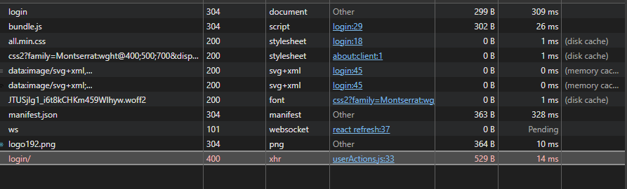

Solution:

Change user_name = 'email' in views.py. After that, it worked:

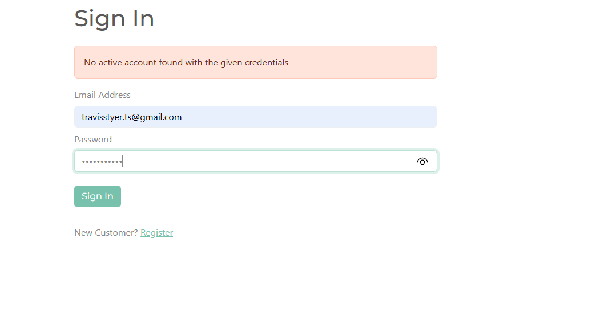

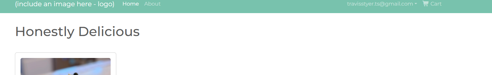

**NEED TO CHANGE THE LOG IN DISPLAY - CHANGE FROM DISPLAYING THEIR EMAIL, TO 'LOG OUT'**

#### Login to Checkout Testing

1. I first successfully logged in:

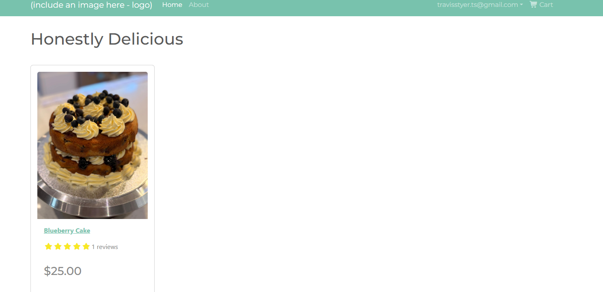

2. I then added the single item to my basket:

3. I then clicked on checkout:

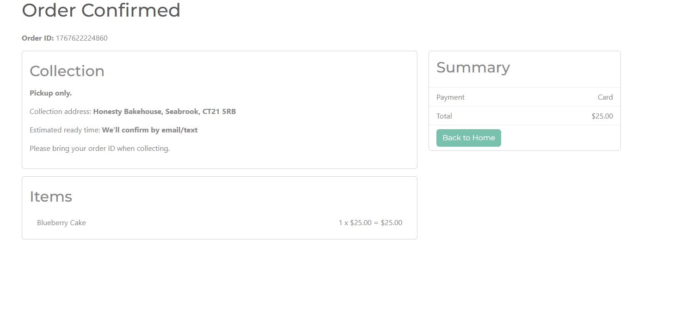

**NOW, ENSURE PAYMENT DETAILS ARE TAKEN BEFORE ORDER PLACED**

### Automated Testing

#### Jest

#### Python Tests

## Using Redux

I chose to use Redux in this app, firstly to learn how it's used, but also because I would end up having many pages that would require a global state. This global state is share in the Redux store and passed down to other pages. 

Having learned the importance of Redux in front end when it comes to building larger apps, I am glad I have included it. I will continue to learn more about it in my future project, but here are some examples of how to install and use Redux:

### Installing Redux

...

### Using Redux

## Installing + Using Stripe

In your terminal - in the backend - type: pip install stripe (for windows).

And for the frontend: npm i @stripe/stripe-js @stripe/react-stripe-js (assuming you used React, like me)

Then, follow these steps:

1. Add stripe secret key settings:

import os
# ...existing...

STRIPE_SECRET_KEY = os.environ.get("STRIPE_SECRET_KEY", "")
STRIPE_PUBLISHABLE_KEY = os.environ.get("STRIPE_PUBLISHABLE_KEY", "")

## Installing Font Awesome

When building a site with React, the simplest way to install and use Font Awesome is to install it using the terminal. 

1. From the root, type 'npm install @fontawesome/fontawesome-free'.
2. Then, to use icons, you simply start by creating an icon (<i></i>) section. 
3. Within the opening tag, you type in the 'className' of the icon you want to display. Or, you can somply copy the html from the font awesome website.

Example: These 'i' tags were copied from the free icons section in Font Awesome.

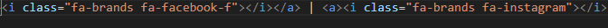

### Bugs

#### Frontend Bugs

1. Product Display Bug

The above image shows a classic bug caused by using Javascript Style comments within a JSX sextion. To remove this problem, I simply put curly braces around the Javascript style comments within thye JSX section, and it was resolved. 

Here it is fixed:

2. Product Screen (First bug)

The error is clear - 'Product' is not recognised. So, to solve this, I did some searching and found that the error was simple: misspelled 'product' as 'Product'. 

So I changed it to as lower-case p, and it worked:

3. Go Back Button

This above image shows a blank screen, but there should be a 'Go Back' button listed, as that is what I had coded to be returned on this page. I learned that this was due to the spelling of a className used in the link: 'btn-Light' should be 'btn-light'. 

Solved:

4. 500 Error

This bug was the result of my images not displaying on the home screen. 

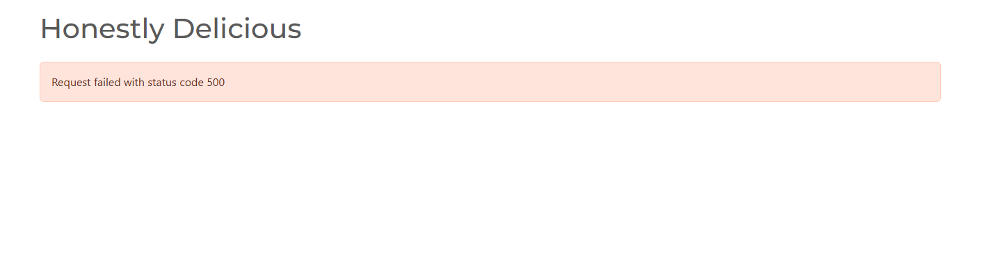

The solution to this was found by the errors notes in the console:

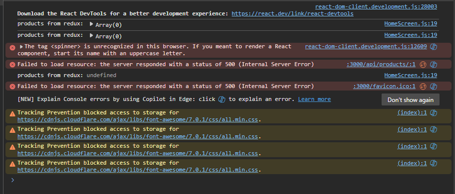

This was solved by changing the 's' in 'spinner' to uppercase within my "Loading" component. 

Solved:

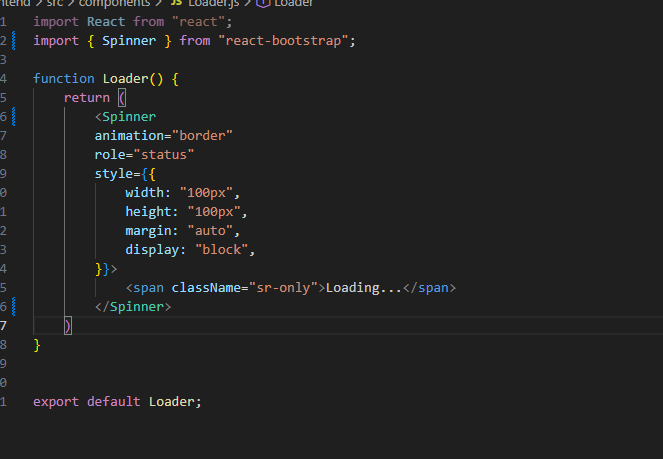

5. Adding To Cart

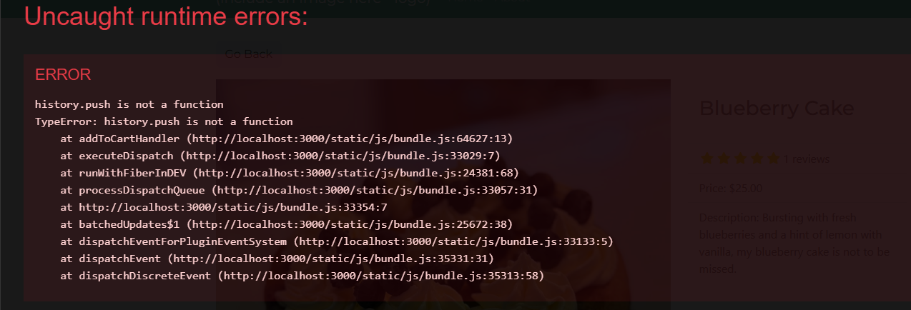

I learned that in V6, there is no 'history.push' function. So I had to rewrite my code. Google AI informed me that 'navigate' is used as a replacement.

Once that was replaced, it worked, and I continued with the manual test of adding to cart. 

#### Backend Bugs

1. Axios Bug

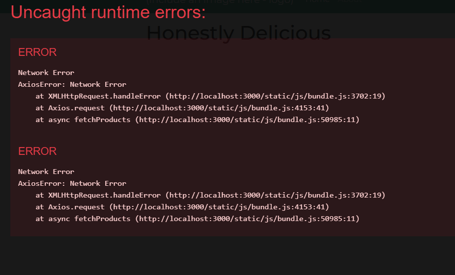

After some research, I learned that this bug means that my request never reached my Django API. 

--- 

### Setting Up Virtual Environment

Before you begin any work on the backend, it's best to set up your virutal environment. To do this, type the command "pip install virtualenv" into your terminal. Once installed, you are ready to activate the virtual environment. 

The screenshot below shows how this is done in the terminal:

Then, once activated, you will see ".venv" at the far left of your terminal:

Following that, you'll want to install django with "pip install django", and this will install the latest version:

### Creating Django Project

Once installed, you will then want to create the backend project using "django-admin startproject (projectname)"

I called mine 'Backend', so you can see it successfuly created below ".venv" in this screenshot:

### Creating Individual Apps

Once Django is ready, it's time to start creating backend apps. Before you do this, you will need to change into the project directory. For me, this command is "cd backend" from the root directory. 

Then, you will need to type the command "python manage.py startapp (appname)":

### Writing Your First View

When it comes to ensuring the backend project is connected to your backend app, you need to test that using a basic view and url pattern. I did this by first writing a view called getRoutes and returning 'Hello World.' 

Once that view is written, I then created a urls.py folder in the only app I have ('base'), and then importing that view I just created. 

I created the url pattern which states that when hitting the homescreen (''), I render the view getRoutes, and I gave it the name "get-routes". 

However, this wouldn't work just yet; I needed to connect the urls I created in the app to the main urls.py file in the backend project (called 'backend').

To do this, first add 'include' to the list of imports from django.urls. 

Then, add a new path to the urlpatterns. This will be as shown in the below screenshot:

### Using Django Rest Framework

The reason I decided to do this was because the Django Rest Framework will make my api's more powerfull. 

To install it, type this into your terminal: "pip install djangorestframework".

Once that is successfull, add 'rest_framework' to your installed apps section in settings.py. 

From there, you will need to head over to https://www.django-rest-framework.org/, and click on views, under the 'api' section:

Then, on the right hand side of the screen, click on 'api_view' and copy the highlighted text below to then paste into the views.py in your app:

Once you've added that, you will also need to import 'Response'.

## Amending Backend Data

To amend your backend data, you will first need to be able to log into the Django admin panel. To do this, start by creating a super user. 

1. In your terminal, ensure you are in the directory that holds manage.py. For me, it is the backend directory. 
2. Create your super user with "python manage.py createsuperuser", and then follow the instructions to set a user name, email and password.
3. Run the server: "python manage.py runserver".
4. From here, append the url with "/admin/" and you will be redirected to the Django Admin login dashboard. Enter your super user name and password to log in. 

This was my view onced logged in:

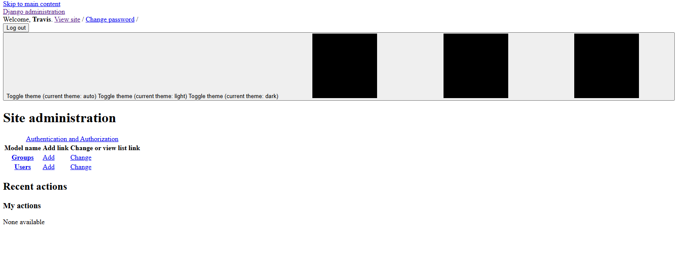

### Making New Databases

When you log into the backend, you shouldn't see any databases there yet. The first thing that needs to be done, is to create a data model in models.py, within the app. 

The first one I created was the product model.

Once it was fully coded, I ran migrations, then registered the new model in admin.py, which then sends the model to the django server.

To run migrations, simply: "python manage.py makemigrations"

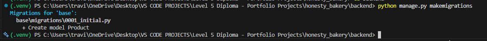

At this point, you have a chance to see if the migrations are correct before fully migrating. If so: "python manage.py migrate"

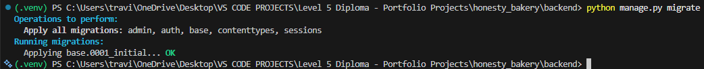

Here, you can see the first model created in the Django Admin: Products

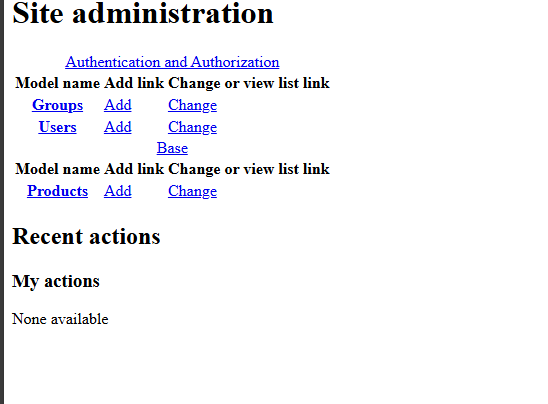

## Authentication

### JSON Web Tokens

These are just encoded data about a user. 

## Tech. Used

1. HTML5
2. CSS3
3. ReactBoostrap, found (https://react-bootstrap.netlify.app/)[here].
4. Bootswatch.
5. React.js
6. JavaScript
7. Django
8. Django Rest Framework
9. LucidChart

10. Redux
